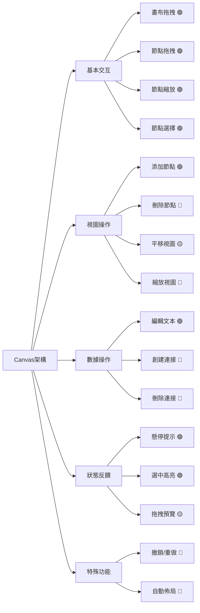
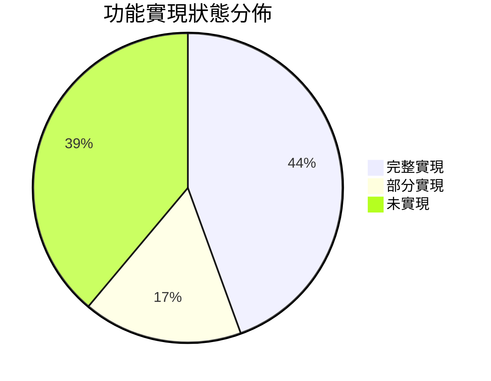
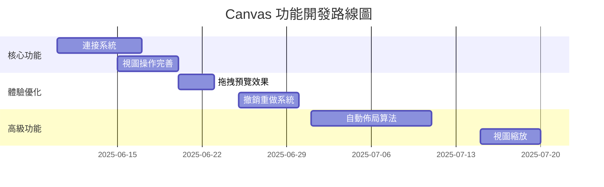
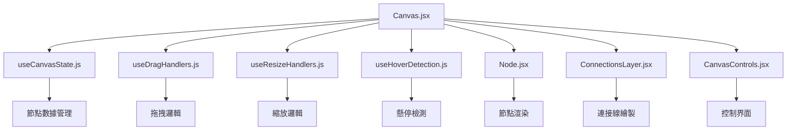

# Canvas 元件架構思維導圖

## 整體架構

## 功能狀態說明
| 狀態標記 | 含義          | 數量 |
|----------|---------------|------|
| 🟢       | 完整實現      | 8    |
| 🟡       | 部分實現      | 3    |
| 🔴       | 未實現        | 7    |

## 詳細狀態分佈

## 後續開發路線圖

## 文件依賴關係
