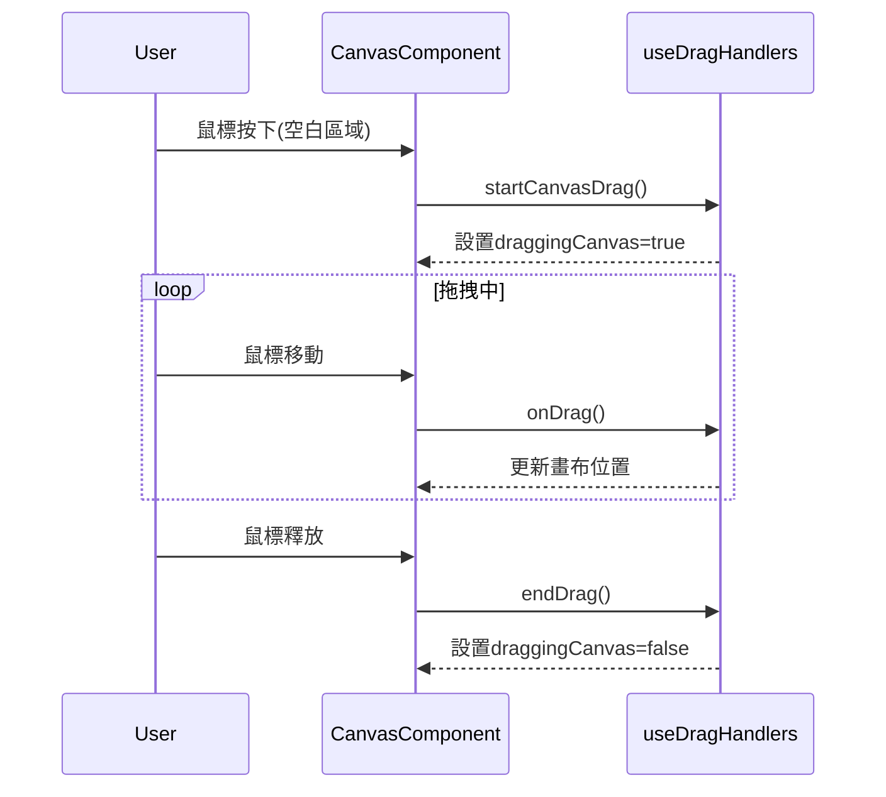

# 畫布拖拽功能架構

## 功能描述
允許用戶拖動整個畫布來瀏覽超出視口的內容區域

## 核心文件
- [`useDragHandlers.js`](src/Canvas/hooks/useDragHandlers.js)
  - `startCanvasDrag()`: 初始化拖拽狀態
  - `onDrag()`: 處理拖拽中的位移計算
  - `endDrag()`: 結束拖拽狀態

## 交互流程

## 實現機制
1. 通過`useRef`獲取畫布DOM元素
2. 鼠標事件轉發到拖拽處理器
3. 實時計算畫布位移量
4. 更新畫布transform樣式