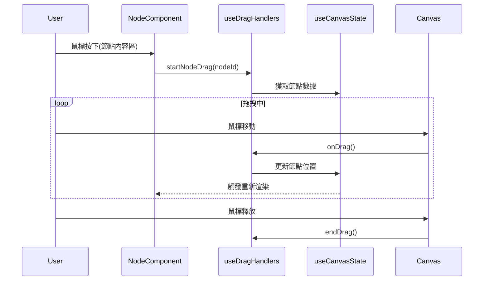

# 節點拖拽功能架構

## 功能描述
允許用戶拖動單個節點在畫布中移動位置

## 核心文件
- [`useDragHandlers.js`](src/Canvas/hooks/useDragHandlers.js)
  - `startNodeDrag()`: 初始化節點拖拽狀態
  - `onDrag()`: 計算節點新位置
- [`Node.jsx`](src/Canvas/components/Node.jsx)
  - 處理鼠標按下事件
  - 更新節點位置樣式

## 交互流程

## 實現機制
1. 節點組件捕獲鼠標按下事件
2. 拖拽處理器計算節點位移
3. 狀態鉤子更新節點位置
4. React響應式更新節點位置