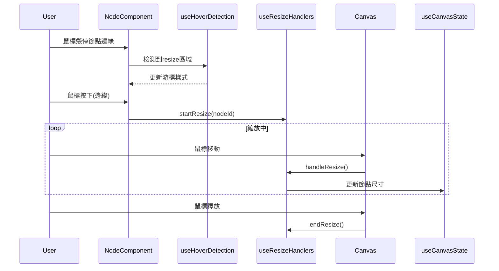

# 節點縮放功能架構

## 功能描述
允許用戶通過拖動節點邊緣調整節點尺寸

## 核心文件
- [`useResizeHandlers.js`](src/Canvas/hooks/useResizeHandlers.js)
  - `startResize()`: 初始化縮放狀態
  - `handleResize()`: 計算新尺寸
  - `endResize()`: 結束縮放
- [`useHoverDetection.js`](src/Canvas/hooks/useHoverDetection.js)
  - 檢測懸停在縮放區域

## 交互流程

## 實現機制
1. 懸停檢測識別縮放區域
2. 鼠標按下時記錄初始尺寸和位置
3. 拖動時計算尺寸變化
4. 限制最小/最大尺寸