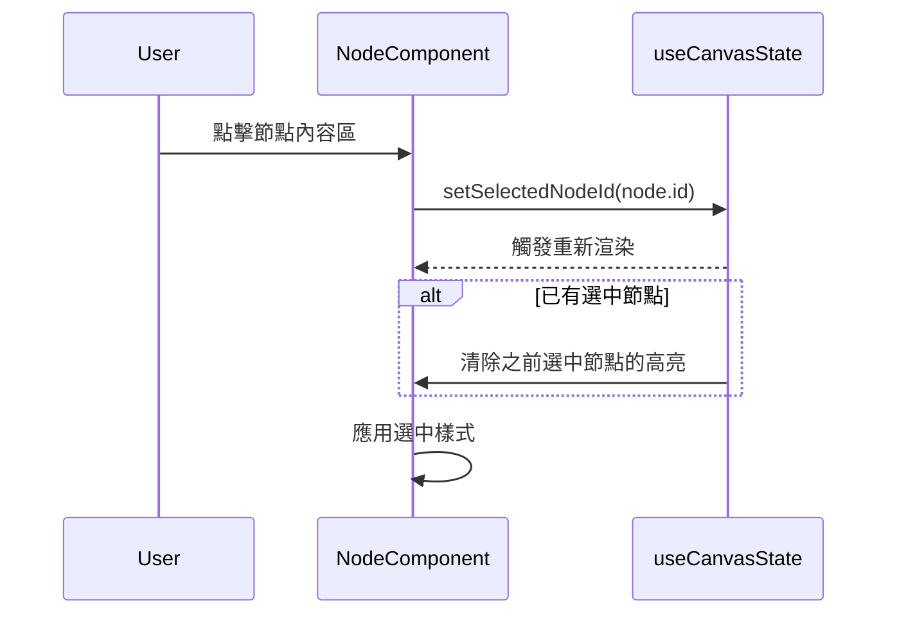

# 節點選擇功能架構

## 功能描述
允許用戶點擊節點將其選中，選中節點可進行後續操作

## 核心文件
- [`useCanvasState.js`](src/Canvas/hooks/useCanvasState.js)
  - `selectedNodeId`: 存儲當前選中節點ID
  - `setSelectedNodeId()`: 設置選中節點
- [`Node.jsx`](src/Canvas/components/Node.jsx)
  - 處理點擊事件
  - 根據選中狀態應用不同樣式

## 交互流程

## 實現機制
1. 點擊節點時更新全局狀態中的選中節點ID
2. 所有節點監聽選中狀態變化
3. 選中節點應用特殊樣式（邊框加粗/顏色變化）
4. 點擊空白區域時清除選中狀態