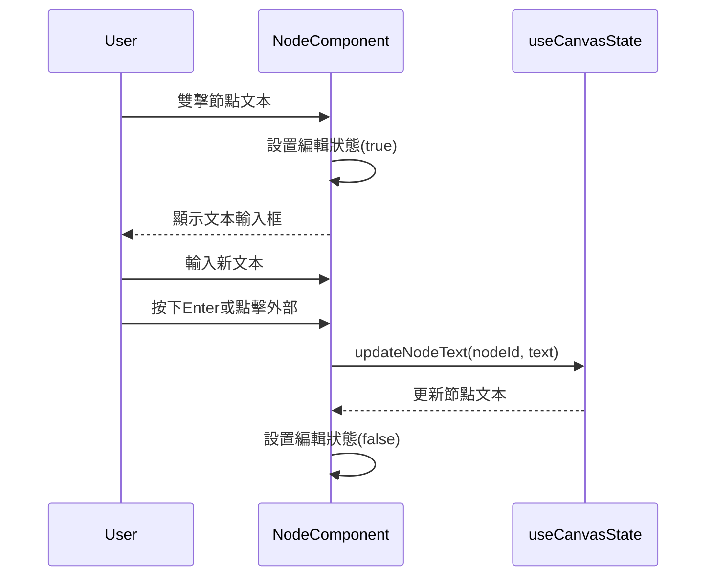

# 編輯文本功能架構

## 功能描述
允許用戶雙擊節點編輯其文本內容

## 核心文件
- [`Node.jsx`](src/Canvas/components/Node.jsx)
  - 處理雙擊事件
  - 渲染文本編輯輸入框
- [`useCanvasState.js`](src/Canvas/hooks/useCanvasState.js)
  - `updateNodeText()`: 更新節點文本內容

## 交互流程

## 實現機制
1. 雙擊觸發編輯模式
2. 顯示文本輸入框並自動聚焦
3. 提交時調用狀態更新函數
4. 節點文本實時更新