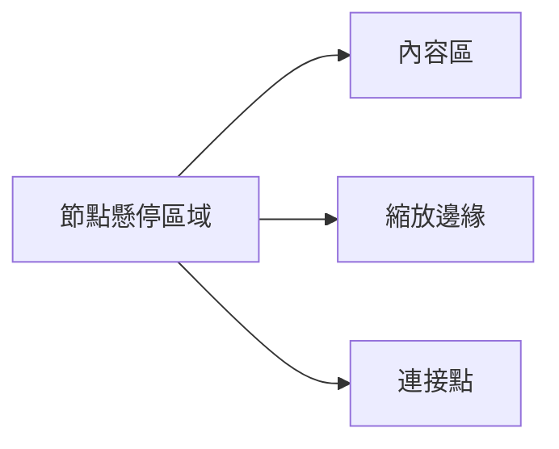
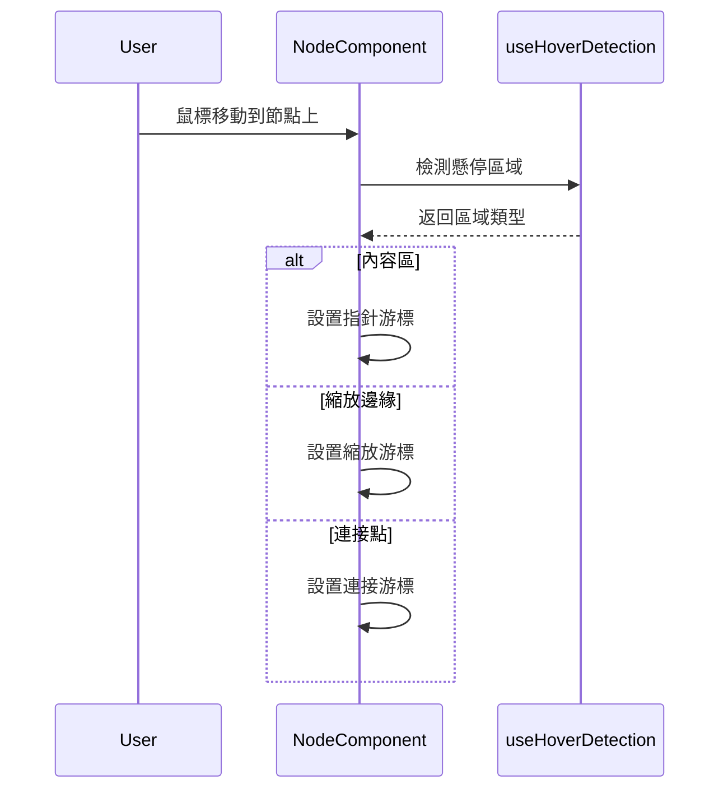

# 懸停提示功能架構

## 功能描述
當用戶將鼠標懸停在節點不同區域時，提供視覺反饋（如游標變化、區域高亮）

## 核心文件
- [`useHoverDetection.js`](src/Canvas/hooks/useHoverDetection.js)
  - `checkHoverArea()`: 檢測鼠標在節點的哪個區域
  - `hoverState`: 存儲當前懸停狀態
- [`Node.jsx`](src/Canvas/components/Node.jsx)
  - 根據懸停狀態應用不同樣式
  - 設置不同區域的游標樣式

## 懸停區域分類

## 交互流程

## 實現機制
1. 實時檢測鼠標相對於節點的位置
2. 根據坐標判斷懸停區域
3. 更新懸停狀態觸發重新渲染
4. 根據區域類型應用不同視覺效果