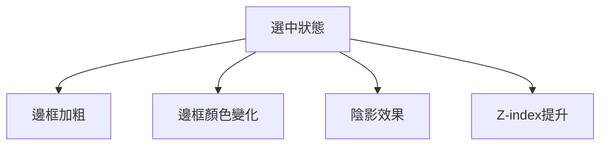
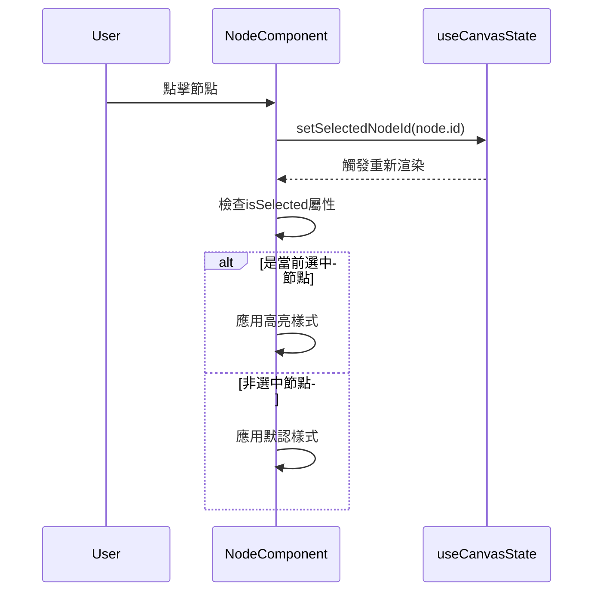

# 選中高亮功能架構

## 功能描述
當節點被選中時，應用特殊樣式進行視覺強調，使其在畫布中突出顯示

## 核心文件
- [`useCanvasState.js`](src/Canvas/hooks/useCanvasState.js)
  - `selectedNodeId`: 存儲當前選中節點ID
- [`Node.jsx`](src/Canvas/components/Node.jsx)
  - 根據選中狀態應用不同樣式
  - `isSelected`屬性控制高亮效果

## 視覺效果

## 交互流程

## 實現機制
1. 全局狀態管理選中節點ID
2. 節點組件接收選中狀態作為prop
3. 使用CSS條件渲染應用高亮樣式
4. 選中節點提升z-index確保顯示在最上層
5. 點擊畫布空白區域時清除選中狀態