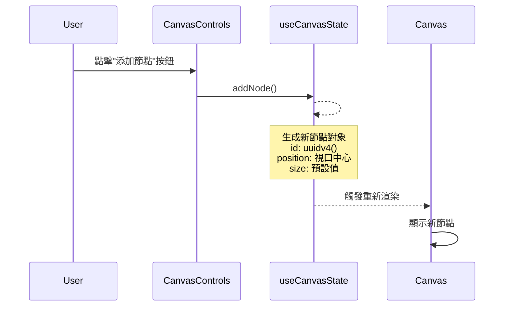

# 添加節點功能架構

## 功能描述
允許用戶通過控制欄按鈕在畫布上添加新節點

## 核心文件
- [`CanvasControls.jsx`](src/Canvas/components/CanvasControls.jsx)
  - 渲染添加按鈕
  - 觸發添加節點事件
- [`useCanvasState.js`](src/Canvas/hooks/useCanvasState.js)
  - `addNode()`: 創建新節點邏輯
  - 生成唯一ID
  - 設置默認位置和尺寸

## 交互流程

## 實現機制
1. 控制組件提供添加按鈕
2. 點擊時調用狀態鉤子的`addNode`方法
3. 新節點生成在當前視口中心位置
4. 自動分配唯一ID避免衝突
5. 默認尺寸為200x150像素